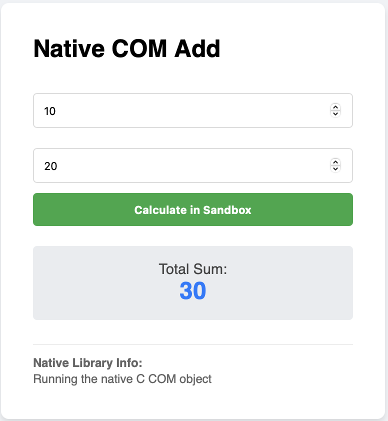
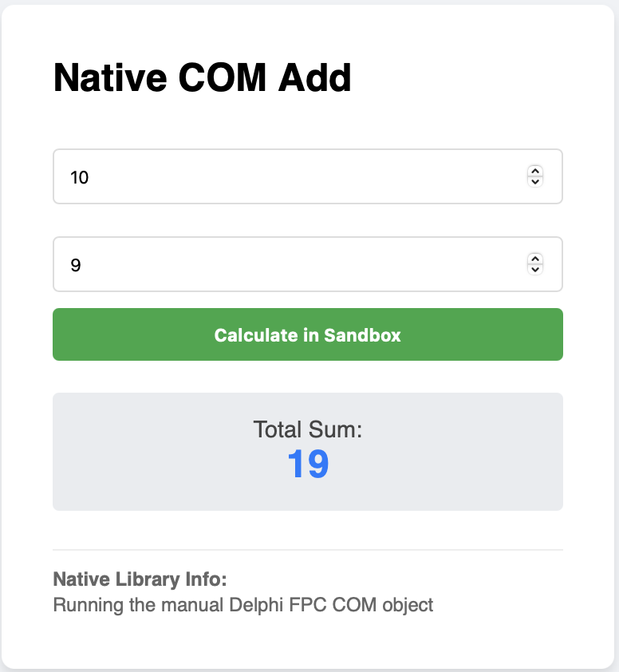

# Running a 32 bit Com Object

In this guide, we will write a modern **.NET 10 Web API**. I am coding on a Mac. This API will control a legacy **32-bit COM Object**. Since we cannot run 32-bit COM on macOS, we will deploy to **Azure App Service (Free Tier)** to watch it work.

## Phase 1: Project Setup (VS Code Terminal)

We will set up the structure. Note that we can *build* .NET Framework 4.8 libraries on a Mac using the .NET SDK, even if we can't run them.

```bash
# 1. Create the folder structure
mkdir ComSandboxDemo
cd ComSandboxDemo

# 2. Create the solution
dotnet new sln

# 3. Create the "Host" app (The Azure Web API)
dotnet new webapi -n AzureSandboxHost -f net10.0

# 4. Create the Contracts (Shared Interface)
dotnet new classlib -n Contracts -f netstandard2.0

# 5. Link projects to solution
dotnet sln add AzureSandboxHost/AzureSandboxHost.csproj
dotnet sln add Contracts/Contracts.csproj

# 6. Add References
dotnet add AzureSandboxHost/AzureSandboxHost.csproj reference Contracts/Contracts.csproj

# 7. Install ProcessSandbox packages
dotnet add AzureSandboxHost/AzureSandboxHost.csproj package ProcessSandbox.Runner --prerelease
dotnet add Contracts/Contracts.csproj package ProcessSandbox.Abstractions --prerelease

```

## Phase 2: The Contracts

** Contracts (`Contracts/ICalculator.cs`):**

```csharp
using System.Runtime.InteropServices;
namespace Contracts;

/// <summary>
/// A simple calculator interface
/// </summary>
[Guid("E1234567-ABCD-1234-EF12-0123456789AB")] // Matches the IID in our C code
[InterfaceType(ComInterfaceType.InterfaceIsIUnknown)]
public interface ICalculator
{
    /// <summary>
    /// Adds two integers
    /// </summary>
    /// <param name="a"></param>
    /// <param name="b"></param>
    /// <returns></returns>
    [PreserveSig] // Native COM usually returns HRESULT; this ensures 'int' is treated as the direct return
    int Add(int a, int b);
    /// <summary>
    /// Gets system information
    /// </summary>
    /// <returns></returns>
    [PreserveSig]
    [return: MarshalAs(UnmanagedType.BStr)] // Explicitly tell .NET to expect a BSTR
    string GetInfo();
}

```

## Phase 3: The Host (Azure Web API)

A nice simple calculator interface to test calling the com object via the net48 32 bit proxy

Open `AzureSandboxHost/Program.cs`.

```csharp
using System.ComponentModel;
using Contracts;
using ProcessSandbox.Pool;
using ProcessSandbox.Proxy;

var builder = WebApplication.CreateBuilder(args);
var app = builder.Build();

// 1. Configure the Sandbox
var config = new ProcessPoolConfiguration
{
    // Ensure we use the 32-bit .NET 4.8 Worker
    DotNetVersion = DotNetVersion.Net48_32Bit, 
    MinPoolSize = 1,
    MaxPoolSize = 2,
    
    // The com object needs putting in the win-x86 folder manually 
    ImplementationAssemblyPath = Path.Combine(
        AppContext.BaseDirectory, 
        "workers", "net48", "win-x86", "SimpleCom.dll"),

    ComClsid = new Guid("11111111-2222-3333-4444-555555555555")      
};

var loggerFactory = LoggerFactory.Create(b => 
{
    b.AddConsole();
    b.SetMinimumLevel(LogLevel.Debug);
});

// 2. Create the Proxy Factory
using var factory = await ProcessProxyFactory<ICalculator>.CreateAsync(config, loggerFactory);

app.MapGet("/", () => 
{
    var html = @"
    <!DOCTYPE html>
    <html>
    <head>
        <title>Native COM Calculator</title>
        <style>
            body { font-family: sans-serif; display: flex; justify-content: center; padding: 50px; background: #f0f2f5; }
            .card { background: white; padding: 2rem; border-radius: 8px; box-shadow: 0 4px 6px rgba(0,0,0,0.1); width: 320px; }
            input { width: 100%; padding: 10px; margin: 10px 0; border: 1px solid #ddd; border-radius: 4px; box-sizing: border-box; }
            button { width: 100%; padding: 10px; background: #28a745; color: white; border: none; border-radius: 4px; cursor: pointer; font-weight: bold; }
            button:hover { background: #218838; }
            #result-box { margin-top: 20px; padding: 15px; border-radius: 4px; background: #e9ecef; display: none; text-align: center; }
            .result-val { font-size: 1.5rem; color: #007bff; font-weight: bold; }
            .info { font-size: 0.75rem; color: #666; margin-top: 1.5rem; border-top: 1px solid #eee; padding-top: 10px; line-height: 1.4; }
        </style>
    </head>
    <body>
        <div class='card'>
            <h2 style='margin-top:0'>Native COM Add</h2>
            <form id='calcForm'>
                <input type='number' id='x' name='x' placeholder='First Number' required />
                <input type='number' id='y' name='y' placeholder='Second Number' required />
                <button type='submit' id='btn'>Calculate in Sandbox</button>
            </form>

            <div id='result-box'>
                <div style='font-size: 0.9rem; color: #444;'>Total Sum:</div>
                <div id='sum-display' class='result-val'>0</div>
            </div>

            <div class='info'>
                <strong>Native Library Info:</strong><br/>
                <span id='engine-info'>Not run yet</span>
            </div>
        </div>

        <script>
            document.getElementById('calcForm').addEventListener('submit', async (e) => {
                e.preventDefault();
                const btn = document.getElementById('btn');
                const box = document.getElementById('result-box');
                const display = document.getElementById('sum-display');
                const engineInfo = document.getElementById('engine-info');
                
                btn.disabled = true;
                btn.innerText = 'Processing...';

                try {
                    const formData = new FormData(e.target);
                    const response = await fetch('/calculate', {
                        method: 'POST',
                        body: formData
                    });
                    
                    const data = await response.json();
                    
                    if (data.success) {
                        display.innerText = data.result;
                        engineInfo.innerText = data.engine;
                        box.style.display = 'block';
                    } else {
                        alert('Error: ' + data.detail);
                    }
                } catch (err) {
                    alert('Request failed. Check Azure logs.');
                } finally {
                    btn.disabled = false;
                    btn.innerText = 'Calculate in Sandbox';
                }
            });
        </script>
    </body>
    </html>";

    return Results.Content(html, "text/html");
});

app.MapPost("/calculate", async (HttpRequest request) => 
{
    try 
    {
        // Parse form values
        var form = await request.ReadFormAsync();

        if(form["x"].Count == 0 || form["y"].Count == 0)
        {
            throw new Exception("Both 'x' and 'y' values are required.");
        }

        int x = int.Parse(form["x"]!);
        int y = int.Parse(form["y"]!);

        // Call our 32-bit Native COM object via the Sandbox Proxy
        var (sum, info) = await factory.UseProxyAsync(async proxy =>
        {
            return ( proxy.Add(x, y), proxy.GetInfo() );
        });

        return Results.Ok(new { 
            Success = true, 
            Input = new { x, y }, 
            Result = sum, 
            Engine = info 
        });
    }
    catch (Exception ex)
    {
        return Results.Problem(ex.Message);
    }
});

app.Run();

```

### Phase 4: The com object 

For this we create a simple c com object.

Create a folder called SimpleCom

Create a file called SimpleCom.c

Populate it with the following code

```c
#include <initguid.h>
#include <windows.h>
#include <objbase.h>
#include <stdlib.h>

// CLSID: {11111111-2222-3333-4444-555555555555}
static const GUID CLSID_SimpleCalculator = { 0x11111111, 0x2222, 0x3333, { 0x44, 0x44, 0x55, 0x55, 0x55, 0x55, 0x55, 0x55 } };
// IID: {E1234567-ABCD-1234-EF12-0123456789AB}
static const GUID IID_ICalculator = { 0xE1234567, 0xABCD, 0x1234, { 0xEF, 0x12, 0x01, 0x23, 0x45, 0x67, 0x89, 0xAB } };

// --- 1. COM Object (The Calculator) ---

// Renamed struct to avoid collision with system headers
typedef struct MyCalculatorVtbl {
    HRESULT (__stdcall *QueryInterface)(void*, REFIID, void**);
    ULONG (__stdcall *AddRef)(void*);
    ULONG (__stdcall *Release)(void*);
    int (__stdcall *Add)(void*, int, int);
    BSTR (__stdcall *GetInfo)(void*);
} MyCalculatorVtbl;

typedef struct {
    MyCalculatorVtbl* lpVtbl;
    long count;
} SimpleCalculator;

HRESULT __stdcall QueryInterface(void* this, REFIID riid, void** ppv) {
    if (IsEqualGUID(riid, &IID_IUnknown) || IsEqualGUID(riid, &IID_ICalculator)) {
        *ppv = this;
        ((IUnknown*)this)->lpVtbl->AddRef(this);
        return S_OK;
    }
    *ppv = NULL;
    return E_NOINTERFACE;
}

ULONG __stdcall AddRef(void* this) {
    return InterlockedIncrement(&((SimpleCalculator*)this)->count);
}

ULONG __stdcall Release(void* this) {
    ULONG count = InterlockedDecrement(&((SimpleCalculator*)this)->count);
    if (count == 0) free(this);
    return count;
}

int __stdcall Add(void* this, int a, int b) {
    return a + b;
}

BSTR __stdcall GetInfo(void* this) {
    return SysAllocString(L"Running the native C COM object");
}

static MyCalculatorVtbl CalculatorVtbl = { QueryInterface, AddRef, Release, Add, GetInfo };

// --- 2. Class Factory ---

// Renamed struct to avoid collision with system headers
typedef struct MyClassFactoryVtbl {
    HRESULT (__stdcall *QueryInterface)(void*, REFIID, void**);
    ULONG (__stdcall *AddRef)(void*);
    ULONG (__stdcall *Release)(void*);
    HRESULT (__stdcall *CreateInstance)(void*, IUnknown*, REFIID, void**);
    HRESULT (__stdcall *LockServer)(void*, BOOL);
} MyClassFactoryVtbl;

typedef struct {
    MyClassFactoryVtbl* lpVtbl;
} SimpleClassFactoryStruct;

HRESULT __stdcall Factory_QueryInterface(void* this, REFIID riid, void** ppv) {
    if (IsEqualGUID(riid, &IID_IUnknown) || IsEqualGUID(riid, &IID_IClassFactory)) {
        *ppv = this;
        return S_OK;
    }
    *ppv = NULL;
    return E_NOINTERFACE;
}

ULONG __stdcall Factory_AddRef(void* this) { return 2; }
ULONG __stdcall Factory_Release(void* this) { return 1; }

HRESULT __stdcall Factory_CreateInstance(void* this, IUnknown* pUnkOuter, REFIID riid, void** ppv) {
    if (pUnkOuter != NULL) return CLASS_E_NOAGGREGATION;

    SimpleCalculator* obj = (SimpleCalculator*)malloc(sizeof(SimpleCalculator));
    if (!obj) return E_OUTOFMEMORY;
    
    obj->lpVtbl = &CalculatorVtbl;
    obj->count = 1;

    HRESULT hr = obj->lpVtbl->QueryInterface(obj, riid, ppv);
    obj->lpVtbl->Release(obj); 
    return hr;
}

HRESULT __stdcall Factory_LockServer(void* this, BOOL fLock) { return S_OK; }

static MyClassFactoryVtbl ClassFactoryVtbl = { 
    Factory_QueryInterface, Factory_AddRef, Factory_Release, 
    Factory_CreateInstance, Factory_LockServer 
};

static SimpleClassFactoryStruct SimpleClassFactory = { &ClassFactoryVtbl };

// --- 3. DLL Exports ---

HRESULT __stdcall DllGetClassObject(REFCLSID rclsid, REFIID riid, LPVOID* ppv) {
    if (IsEqualGUID(rclsid, &CLSID_SimpleCalculator)) {
        return SimpleClassFactory.lpVtbl->QueryInterface(&SimpleClassFactory, riid, ppv);
    }
    return CLASS_E_CLASSNOTAVAILABLE;
}

HRESULT __stdcall DllCanUnloadNow() { return S_FALSE; }
BOOL WINAPI DllMain(HINSTANCE hinst, DWORD reason, LPVOID reserved) { return TRUE; }

```

To build the executable completely stand alone you need a c compliler.

On a mac you can do this:

```bash
brew install mingw-w64
```

And then to build you need to the following. Pay close attention to the flags, you require these to make it completely stand alone and have the right entry points. Com is fiddly!


Also note here we are pushing it to a publish folder. When you deploy your zip file to azure you will need the SimpleCom.dll in there.


```bash
i686-w64-mingw32-gcc -shared -static -o publish/workers/net48/win-x86/SimpleCom.dll SimpleCom/SimpleCom.c -lole32 -loleaut32 -Wl,--add-stdcall-alias
```


### Phase 6: Deploy to Azure (Free Tier)

Now for the payoff. We will push this Mac-built code to a Windows server.

1. **Install Azure CLI** (if you haven't):
```bash
brew install azure-cli
az login

```


2. **Deploy from Terminal:**
We use `az webapp up` which handles creating the Resource Group and App Service plan automatically.
**Important:** We must specify `--os-type Windows` because the default for .NET 10/Core is often Linux, but we *need* Windows to run the Net48 worker.
```bash
# Run this in the /ComSandboxDemo folder
az webapp up --sku F1 --name my-unique-sandbox-app --os-type Windows --location westeurope

```

*(Replace `my-unique-sandbox-app` with a unique name).*

3. **Wait for Deployment:**
Azure will bundle your code, upload it, build it remotely (or use your local build), and start the site.

If this fails you may need publish and zip up the site manually and add it. Grab hold of the resource group name the previous step created

Clean and publish locally

```bash
# 1. Clean old artifacts
dotnet clean

# 2. Publish the Host (this also triggers the MSBuild script for the manifest)
dotnet publish AzureSandboxHost/AzureSandboxHost.csproj -c Release -o ./publish
```

Add you com object into the win-x86 folder so it can be loaded by the LegacyLibrary service

```bash
i686-w64-mingw32-gcc -shared -static -o publish/workers/net48/win-x86/SimpleCom.dll SimpleCom/SimpleCom.c -lole32 -loleaut32 -Wl,--add-stdcall-alias
```

Zip the output - you need to zip the contents of the publish folder, not the folder itself

```bash
cd publish
zip -r ../site.zip *
cd ..
```

Push to Azure

```bash
az webapp deployment source config-zip \
    --resource-group replace_with_resource_group_name \
    --name my-unique-sandbox-app \
    --src site.zip
```

Ensure the App Service itself allows 32-bit processes

```bash
az webapp config set \
    --resource-group replace_with_resource_group_name \
    --name my-unique-sandbox-app \
    --use-32bit-worker-process true
```

## What you will see

If you run `dotnet run` locally on your Mac, it will crash when you hit the endpoint because `ProcessSandbox` cannot find `ProcessSandbox.Worker.exe` (it doesn't exist on macOS).

However, navigate to your Azure URL (`https://my-unique-sandbox-app.azurewebsites.net`) and you will see a calculator

There is a [live demo here](https://com-sandbox-demo-app.azurewebsites.net)



## Added bonus com object

If you want to expose the same calculation via Delphi, for instance. Use this:

```delphi
library SimpleComDelphi;

{$MODE DELPHI}

uses
  Windows, ActiveX, ComObj;

const
  CLSID_SimpleCalculator: TGUID = '{11111111-2222-3333-4444-555555555555}';
  IID_ICalculator: TGUID        = '{E1234567-ABCD-1234-EF12-0123456789AB}';

type
  ICalculator = interface(IUnknown)
    ['{E1234567-ABCD-1234-EF12-0123456789AB}']
    function Add(a, b: Integer): Integer; stdcall;
    function GetInfo: TBSTR; stdcall;
  end;

  { The Calculator Implementation }
  TSimpleCalculator = class(TInterfacedObject, ICalculator)
  public
    function Add(a, b: Integer): Integer; stdcall;
    function GetInfo: TBSTR; stdcall;
  end;

  { The Class Factory Implementation }
  TSimpleClassFactory = class(TInterfacedObject, IClassFactory)
  public
    function CreateInstance(const unkOuter: IUnknown; const iid: TGUID; out obj): HResult; stdcall;
    function LockServer(fLock: BOOL): HResult; stdcall;
  end;

{ TSimpleCalculator }

function TSimpleCalculator.Add(a, b: Integer): Integer; stdcall;
begin
  Result := a + b;
end;

function TSimpleCalculator.GetInfo: TBSTR; stdcall;
var
  S: WideString;
begin
  S := 'Running the manual Delphi FPC COM object';
  // Use SysAllocString instead of SysAllocStringLen
  // PWideChar(S) points to the start of the WideString data
  Result := SysAllocString(PWideChar(S));
end;

{ TSimpleClassFactory }

function TSimpleClassFactory.CreateInstance(const unkOuter: IUnknown; const iid: TGUID; out obj): HResult; stdcall;
var
  CalcIntf: ICalculator;
begin
  Pointer(obj) := nil;
  if unkOuter <> nil then Exit(CLASS_E_NOAGGREGATION);

  try
    // 1. Create the object and immediately assign to an interface variable
    // This sets RefCount to 1.
    CalcIntf := TSimpleCalculator.Create;
    
    // 2. Query for the requested IID (usually ICalculator or IUnknown)
    Result := CalcIntf.QueryInterface(iid, obj);
  except
    Result := E_UNEXPECTED;
  end;
end;

function TSimpleClassFactory.LockServer(fLock: BOOL): HResult; stdcall;
begin
  Result := S_OK;
end;

{ DLL Exports }

function DllGetClassObject(const clsid, iid: TGUID; out obj): HResult; stdcall;
var
  FactoryIntf: IClassFactory;
begin
  Pointer(obj) := nil;
  if IsEqualGUID(clsid, CLSID_SimpleCalculator) then
  begin
    FactoryIntf := TSimpleClassFactory.Create;
    Result := FactoryIntf.QueryInterface(iid, obj);
  end
  else
    Result := CLASS_E_CLASSNOTAVAILABLE;
end;

function DllCanUnloadNow: HResult; stdcall;
begin
  Result := S_FALSE;
end;

exports
  DllGetClassObject,
  DllCanUnloadNow;

begin
end.
```

Compile it with the free pascal compiler
```bash
fpc -Pi386 -Mdelphi -O2 src/tutorials/ComSandboxDemo/SimpleCom/SimpleComDelphi.dpr
```

Put it into the workers/net48/win-x86 folder and change the manifest file in the same directory to point at it (change SimpleCom.dll to SimpleComDelphi.dll)

You are now calling delphi code through your proxy.

